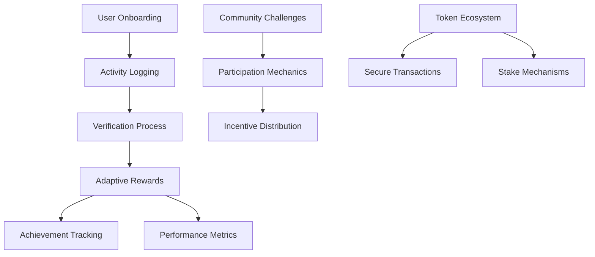

# Living Mega Monitor

Living Mega Monitor is a blockchain-powered fitness tracking system that empowers users to maintain consistent physical activity through an innovative, decentralized incentive platform.

## Overview

Living Mega Monitor revolutionizes fitness motivation by:
- Providing transparent, verifiable workout tracking
- Rewarding users with tokens for consistent exercise
- Creating dynamic, community-driven fitness challenges
- Implementing a fair and engaging token economy
- Encouraging long-term health and wellness goals

## Architecture

The system is built around a sophisticated smart contract that handles:



Core Components:
- Advanced user profile management
- Cryptographically secure workout validation
- Dynamic reward calculation algorithms
- Progressive milestone tracking
- Flexible community challenge framework

## Contract Documentation

### Fitness Hub Contract

The central contract (`fitness-hub`) orchestrates the entire ecosystem:

#### Key Features
- Decentralized user registration
- Comprehensive activity verification
- Adaptive token reward system
- Multi-tier achievement recognition
- Collaborative challenge infrastructure

#### Access Control Model
- Platform administrators: Global system configuration
- Verified oracles: Workout and challenge validation
- Community participants: Interaction and reward earning

## Getting Started

### Prerequisites
- Clarinet
- Stacks wallet for deployment

### Quick Start

1. Initialize User Profile:
```clarity
(contract-call? .fitness-hub register-user)
```

2. Log Physical Activity:
```clarity
(contract-call? .fitness-hub record-workout u45 "strength-training")
```

3. Retrieve User Metrics:
```clarity
(contract-call? .fitness-hub get-user-profile tx-sender)
```

## Function Reference

### User Experience
- `register-user()`: Create personalized fitness profile
- `get-user-profile(principal)`: Access comprehensive fitness metrics

### Activity Management
- `record-workout(uint, string-ascii)`: Document exercise sessions
- `verify-workout(principal, uint)`: Validate completed activities
- `get-workout(principal, uint)`: Retrieve specific workout details

### Economic Interactions
- `get-token-balance(principal)`: Check reward token balance
- `transfer-tokens(principal, uint)`: Exchange reward tokens

### Community Engagement
- `create-challenge(string-ascii, string-utf8, uint, uint, uint)`: Launch fitness challenges
- `join-challenge(uint)`: Participate in community events
- `record-challenge-workout(uint, uint)`: Track challenge-specific progress

## Development Workflow

### Setup
1. Install Dependencies
```bash
npm install -g @stacks/cli
```

2. Initialize Clarinet Environment
```bash
clarinet console
```

### Local Testing
- Run comprehensive test suite
- Simulate various user interaction scenarios
- Validate smart contract logic and security

## Risk Mitigation

### System Constraints
- Cryptographically secured workout verification
- Transparent challenge reward mechanisms
- Immutable token transaction records

### Security Guidelines
- Leverage authorized verification oracles
- Thoroughly review challenge parameters
- Maintain adequate token reserves
- Understand challenge lifecycle and conditions